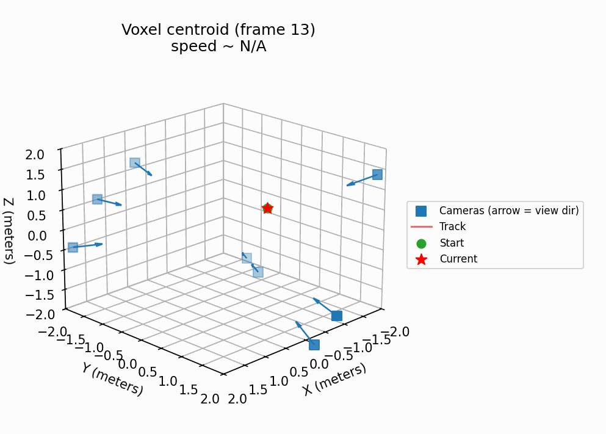

# Voxel

Multi-camera voxel backprojection for motion-based detection.



## Goal
Fuse motion cues from multiple cameras into a 3D voxel grid so small, fast-moving objects that are only a few pixels wide become statistically detectable when many rays intersect.

## Core idea
- Compute per-frame motion (frame differencing baseline; optical flow optional).
- Backproject motion pixels as rays into a voxel grid.
- Accumulate votes; consistent intersections rise above noise.

This is a tomography-style backprojection applied to motion rather than brightness.

## Status
- Implemented: toy sim, offline pipeline, live pipeline.
- Next: clustering/tracking, stronger time sync checks, and performance tuning.

## Repo layout
- `src/` code and experiments
- `docs/` design notes and explanation
- `.gitignore`, `requirements.txt`

## Key docs
- `docs/demo-notes.md` reproducible synthetic demo settings and outputs
- `docs/overview.md` concept overview and limitations
- `docs/pipeline.md` end-to-end data flow and formats
- `docs/technical-brief.md` concise explanation of the design and tradeoffs
- `docs/sources.md` references and inspiration

## Run the toy simulation
```powershell
python -m venv .venv
.\.venv\Scripts\Activate.ps1
pip install -r requirements.txt
python src\poc_sim.py
```

## Quickstart: synthetic end-to-end run
```powershell
python -m venv .venv
.\.venv\Scripts\Activate.ps1
pip install -r requirements.txt
python src\generate_synth_dataset.py --out data\demo_001 --num-frames 120 --width 1280 --height 720 --path-scale 3.0 --spot-sigma 2.0 --noise 1.0 --units meters --units-per-grid-unit 100 --path-mode spline
python src\pipeline.py --dataset data\demo_001 --output output\demo_001 --grid-center 0 0 0 --grid-extent 4 --grid-size 80 --threshold 8 --blur 3 --max-motion-pixels 6000
python src\view_voxels.py --bin output\demo_001\voxel_grid.bin --meta output\demo_001\voxel_grid.json --percentile 99.5 --show
python src\render_voxel_gif.py --dataset data\demo_001 --output output\demo_001 --threshold 8 --blur 3 --max-motion-pixels 6000 --top-k 12 --candidate-k 120 --track-gate 0.6 --smooth-window 5 --integration-window 3 --skip-first 5 --max-frames 70
```

## Presentation GIF (240 frames)
This produces a longer, smoother demo GIF (takes longer to run than the quickstart).
```powershell
python src\generate_synth_dataset.py --out data\demo_001 --num-frames 253 --width 1280 --height 720 --path-scale 3.0 --spot-sigma 2.0 --noise 1.0 --units meters --units-per-grid-unit 100 --path-mode spline
python src\pipeline.py --dataset data\demo_001 --output output\demo_001 --grid-center 0 0 0 --grid-extent 4 --grid-size 80 --threshold 6 --blur 3 --max-motion-pixels 6000
python src\render_voxel_gif.py --dataset data\demo_001 --output output\demo_001 --threshold 6 --blur 3 --max-motion-pixels 6000 --top-k 12 --candidate-k 200 --track-gate 0.12 --smooth-window 5 --integration-window 3 --skip-first 12 --max-frames 240
```

## Real data flow (outline)
```powershell
python src\ingest_videos.py --out data\real_001 --videos cam0.mp4 cam1.mp4 --stride 1
python src\calibrate_intrinsics.py --images calib\cam0\*.png --pattern 9 6 --square-size 0.024 --output calibration\cam_000_intrinsics.json
python src\estimate_extrinsics.py --image calib\cam0_pose.png --intrinsics calibration\cam_000_intrinsics.json --pattern 9 6 --square-size 0.024 --output calibration\cam_000_extrinsics.json
python src\attach_calibration.py --metadata data\real_001\metadata.json --intrinsics-dir calibration --extrinsics-dir calibration
python src\pipeline.py --dataset data\real_001 --output output\real_001 --grid-center 0 0 0 --grid-extent 100 --grid-size 128
```

## Live pipeline (outline)
```powershell
python src\live_pipeline.py --sources 0 1 --intrinsics-dir calibration --extrinsics-dir calibration --grid-center 0 0 0 --grid-extent 100 --grid-size 128 --print-every 30
```
